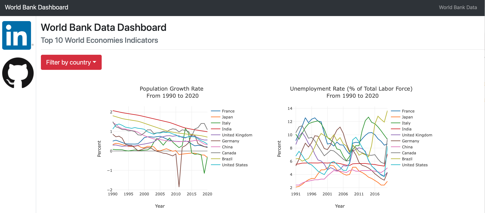

# Exercise—Deploy a Data Dashboard
# World Bank API Data Dashboard

# Installation

- python3
- python packages required in the requirements.txt file

Install packages:
`pip install -r requirements.txt`

To start the web app on MacOS/Linux system: 
* Open terminal
* Go into the directory of the web app files
* Run `python worldbank.py`

# Exercise Goal

The project was completed in a series of exercises to enhance *web development skills as part of the Data Science Nanodegree on [Udacity](https://www.udacity.com).

Deploy a **web app with visualizations** on [Heroku](https://www.heroku.com) as back-end service. Use the web framework [Flask](https://flask.palletsprojects.com/en/2.0.x/) which takes care of all the routing needed to organize the web page.

Most of the work involves:

1. Wrangling the chosen dataset extracted from [World Bank API](https://datahelpdesk.worldbank.org/knowledgebase/articles/889392-about-the-indicators-api-documentation) to get the data in the desired format.
2. Writing Python code to read in the data set and set up plots using [Plotly](https://plotly.com/python/).
3. Modify HTML using the [Bootstrap library](https://getbootstrap.com) to get the desired website design and information.

# File Description

- index.html stored inside the worldbankapp folder contains the HTML font-end code
- wrangle_data.py contains python code to create plotly visualizations using the World Bank API

# Outcome

Link to the web app https://economic-indicators-webapp.herokuapp.com

The web app offers a **World Bank Data Dashboard** with the following **economic indicators**:  
- Population Growth Rate
- Unemployment Rate
- Rate of Female to Male Labor Force Participation Rate
- CO2 Emissions
- GDP Growth Rate

# Licensing, Authors, Acknowledgments

Open-source data from https://data.worldbank.org. 

